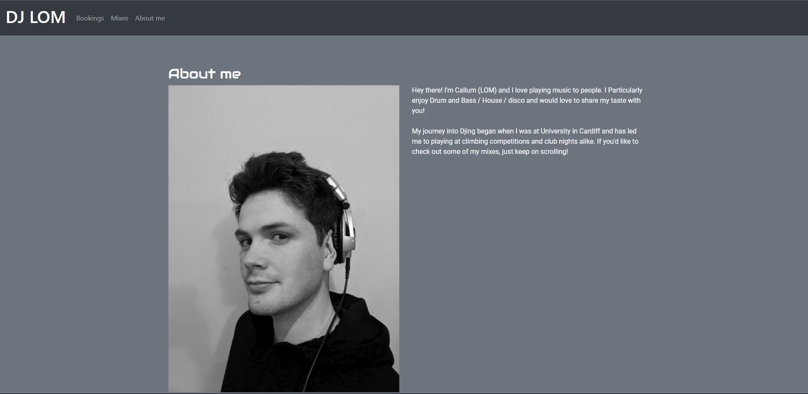

# [DJ LOM Website](https://cjepps.github.io/Milestone-One/)

In this project I will create a website to promote my Djing. I will centralise my mixes that are currently hosted on several external sites (Youtube, Mixcloud). I will also promote my original music here as well as providing a booking form for potential clients to book me. Essentially, my experience is that a lot of people ask me at events who I am but few book me afterwards. My idea is to be able to give them a business card with a QR code linking to this website which should provide more customers and fans of my mixes and music. 

The website will be built responsively so that it looks great on all devices and accessible by all types of customer. I'm am building this webpage firstly to be optimised on mobile phones. It is my belief that this is the most likely format potenial customers and fans will view my website.   

## UX
---

### Project Goals

The Primary goal for this project is to enable potenial clients to book me as a DJ to play at their Venue.
The website will be visually appealing and showcase my work in order for potenial customers/ fans to know more about me and my work.

### User Stories

As a user, I want:

- to be able to view the site on my preferred device (mobile, tablet, desktop)
- to be given an easy way to navigate to the content i want to view.
- to be easily able to contact the DJ with any request that I have.
- to have an easy way to listen to and sample the mixes the DJ will play 
- to be provided with information that tells me more about the DJ 
- to find community links

### Design Choices

I have made the decision to create a single scrollable page as opposed to separate pages linked by a nav bar.
This is because there is not too much content to be displayed on one page and i feel this will aid in discovering other sections (mixes, buying music)

 The first section a user will see will be a hero image of myself with my DJ name visible. Here there will be a simple Navigation bar so that different types of user can find the most appropriate section for them quickly. The most important section on the page will be an about me. I will place this section directly below the main hero image so that customers who might be unfamiliar with me can find out more. This should lead to an increased chance of them scrolling to further sections.

 #### Colour scheme
 - I have decided to go with a monochromatic colour scheme, utilizing some color to highlight important sections or buttons

 #### Typography
 - Roboto is used as the main font with sans-serif as the fallback in case this is not loaded correctly. I have also used Audiowide to style the logo and sub-headings on the page.
 #### Imagery
 - I have chosen to use a fullscreen hero image of myself djing to grab the attention of users. It is the first thing they see when entering the website and it immediately lets the user know that they are on a DJ page. In the about me section, i have chosen to include a profile image of myself to make the page more personal.

 - In the bookings section i have chosen to use a colourful background image to highlight this section. This is one of the most important sections on the site as it should provide business to myself as a DJ. 
   
### Wireframes
- [Mobile resolution wireframe](assets/images/wireframes/mobile-wireframe.pdf)

- [Tablet resolution wireframe](assets/images/wireframes/tablet-wireframe.pdf)

- [Desktop resolution wireframe](assets/images/wireframes/desktop-wireframe.pdf) 

## Features
---
### Existing Features
### Navigation Bar and Hero image
 * This section includes a device responsive Navigation bar which allows for users to immediately select the section they would like to navigate to appropriate to their needs.
 * A Logo with my DJ name is clearly visible which confirms to a user that they have come to the correct website. A large hero image of myself DJing clearly shows what the website is about. 

 

 ### About me section
 * This section allows a user to find out more about me and the music i play. This is useful for users who may not be too familiar with my work.
 * A profile picture is also added to acheive the same end, where useres may be unfamiliar with me.
  
 

 ### Mixes section
  * This section allows for users who are already a fan of my music to listen to more. Alternatively this provides users who are unfamiliar with me and example of my mixes. This section is particularly relevant to  venues who might be looking to book me.
 

 ### Bookings section and Footer
  * This section provides users a means to get in contact with me. Either to find out more about me or to book me for an event.
  * I've provided a footer so that users can easily access my facebook DJ profile, bandcamp, and Youtube channel which should enable me to increase my online visibility and obtain more customers.  
 
### Features left to implement 
 * Features i would like to implement in the future would be the addition of a gallery to show pictures from recent events and the capacity to buy my music directly from this website rather than bandcamp.

## Technologies Used
---
* HTML5
* CSS3 
* Bootstrap
* Font awesome
* Google fonts
* Git
* GitHub
* Balsamiq
* jQuery 
* [Googlefonts CDN](https://fonts.google.com/) 

## Testing
---

### Validator Testing
  No errors were found when passing my HTML or CSS code through the respective W3C validators
 - [HTML Validation](assets/images/Screenshots/djlom-html-validation.PNG)
 - [CSS Validation](assets/images/Screenshots/djlom-css-validation.PNG)

### Testing user stories from UX section
---
As a user I want to be able to view the site on my preferred device (mobile, tablet, desktop)

- Manual testing was undertaken to ensure that each section of the page was viewed correctly at major resolutions

As a user I want to be given an easy way to navigate to the content i want to view.

- The page has been designed to include a navigation bar with a fixed position that is viewable wherever you are on the page. The links are clean and clear, with appropriate titles.

- Users viewing the page on devices with smaller resolutions are presented with an expanding menu that provides bigger navigation links to be clearer.

As a user I want to be easily able to contact the DJ with any request that I have.

- Users are presented with a simple, clean booking form that enables them to enter their request with contact details to contact the DJ

- Alternate link to social media accounts (Facebook) in footer provides an additional contact method.

As a user I want to have an easy way to listen to and sample the mixes the DJ will play

- Embedded media players supplied by Mixcloud iframes enable users to sample mixes without leaving the site.

As a user i want to be provided with information that tells me more about the DJ

- about me section provides a profile image of the DJ with a bio.

As a user i want to find community links

- In the footer, links are provided to access the DJs pages on Mixcloud, Facebook, and Youtube. These links were manually tested to ensure that they link to the website depicted on the icons.

### Further Testing
---
- Website tested on iPhone 5SE, iPad, and Desktop
- Website tested on Google Chrome, Safari, Microsoft Edge

## Deployment
---
### Deploying page to GitHub pages from repository
1. Log in to GitHub and locate the [GitHub Repository](https://github.com/CJepps/Milestone-One)
2. At the top of the Repository, locate the "Settings" Button on the menu.
    
3. Scroll down the Settings page until you locate the "GitHub Pages" Section.
4. Under "Source", click the dropdown called "None" and select "Master Branch".
5. The page will automatically refresh.
6. Scroll back down through the page to locate the now published site [link](https://cjepps.github.io/Milestone-One/) in the "GitHub Pages" section.

### Forking the GitHub Repository

By forking the GitHub Repository we make a copy of the original repository on our GitHub account to view and/or make changes without affecting the original repository by using the following steps...

1. Log in to GitHub and locate the [GitHub Repository](https://github.com/CJepps/Milestone-One)
2. At the top of the Repository just above the "Settings" Button on the menu, locate the "Fork" Button.
3. You should now have a copy of the original repository in your GitHub account.

### Making a Local Clone

1. Log in to GitHub and locate the [GitHub Repository](https://github.com/CJepps/Milestone-One)
2. Under the repository name, click "Clone or download".
3. To clone the repository using HTTPS, under "Clone with HTTPS", copy the link.
4. Open Git Bash
5. Change the current working directory to the location where you want the cloned directory to be made.
6. Type `git clone`, and then paste the URL you copied in Step 3.

7. Press Enter. Your local clone will be created.

*Deployment steps created with reference to the code institute sample readme (https://github.com/Code-Institute-Solutions/SampleREADME)*

## Credits
---
### Larger dependencies included:
 
 * [Bootstrap documentation](https://getbootstrap.com/docs/5.0/getting-started/introduction/)
 * [Fontawesome Documentation](https://fontawesome.com/how-to-use/on-the-web/referencing-icons/basic-use)